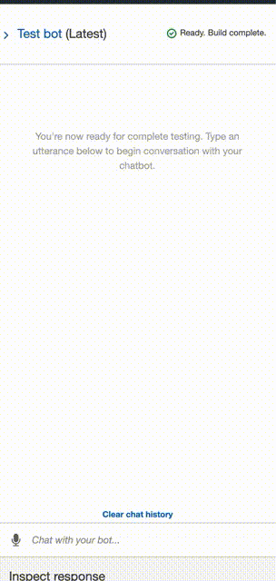

# Unit-13-Challenge
## RoboAdvisor

The homework assignment is on the topic of Robo-Advisor which is an AWS Lex based chat bot tht helps users with retirement advice based on their risk apetite.

# Core Architecture

The bot is based on Amazon Lex v1 bot service.  It has the only intent named `RecommendPortfolio` which listens for utterances around the sentences similar to *I want to invest for my retirement.*

It expects 4 different types of information from the user also known which is held in `slots` and includes:
- `firstName` to capture First Name and has a standard Amazon slot type of `AMAZON.FirstName`
- `age` and `investmentAmount` to capture age and investment amout and both have a standard Amazon slot type of `AMAZON.FirstName`.
- `riskLevel` has a custom slot type to capture a level a risk based on predefined value of Minimal, Low, Medium or High.

## Validations
The bot asks users for various information and performs validations as listed below
- Age between 0 and 65
- Minimum investment amount of 5000.

The validations and the portfolio recommendation is based on the Amazon `Lambda` function and the source code can be found [here](RoboAdvisor/Source%20Code/lambda_function.py).

## Bot Source Code
The bot source code can be found [here](RoboAdvisor/Source%20Code/RoboAdvisor_V1.zip)

## Bot In Action
The followg shows the Bot in action.

